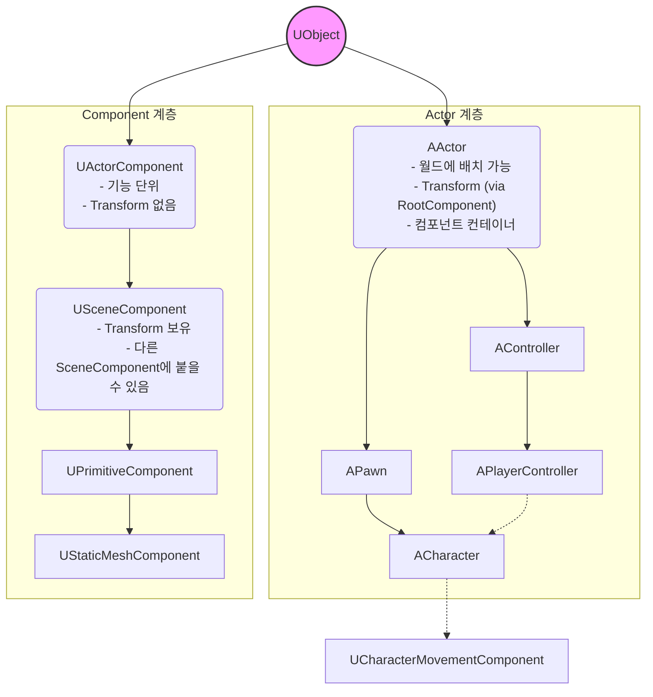

<코드 시작>

Markdown

## 언리얼 엔진 핵심 상속 관계 다이어그램

```mermaid
graph TD
    %% 최상위 클래스
    UObject((UObject))

    %% UObject에서 파생되는 주요 갈래
    UObject --> AActor
    UObject --> UActorComponent

    %% Actor 계층
    subgraph Actor 계층
        AActor("AActor
        - 월드에 배치 가능
        - Transform (via RootComponent)
        - 컴포넌트 컨테이너")
        AActor --> APawn
        APawn --> ACharacter
        
        AActor --> AController
        AController --> APlayerController
    end

    %% Component 계층
    subgraph Component 계층
        UActorComponent("UActorComponent
        - 기능 단위
        - Transform 없음")
        UActorComponent --> USceneComponent

        USceneComponent("USceneComponent
        - Transform 보유
        - 다른 SceneComponent에 붙을 수 있음")
        USceneComponent --> UPrimitiveComponent
        UPrimitiveComponent --> UStaticMeshComponent
    end

    %% 관계 설명 (점선 화살표는 표준 문법)
    ACharacter -.-> UCharacterMovementComponent
    APlayerController -.-> ACharacter

    style UObject fill:#f9f,stroke:#333,stroke-width:2px
```